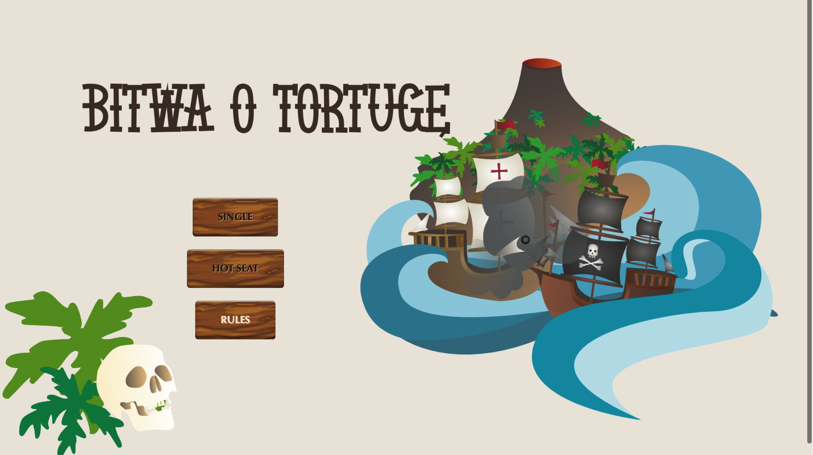
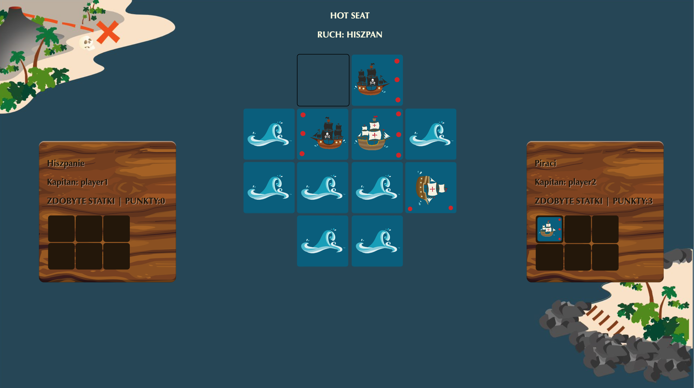

# Bitwa o Tortugę (Battle for Tortuga)


## Overview

"Bitwa o Tortugę" is a Python-based adaptation of the classic board game that takes you on a thrilling adventure in the golden age of piracy. Command your fleet, plunder enemy ships, and stake your claim on the high seas in this exciting turn-based strategy game. Choose between two game modes: Solo and Hottest, for different levels of challenge and excitement.

## Features

- **Two Game Modes**:
  - **Solo Mode**: Test your strategic skills in a one-player adventure.
  - **Hottest Mode**: Challenge your friends in local multiplayer mode and see who can become the ultimate pirate captain.

- **Strategic Gameplay**: Plan your move and outsmart your opponents in a strategic showdown.

## Getting Started

1. **Prerequisites**: Ensure you have Python 3.x installed on your system.

2. **Clone the Repository**:
   ```bash
   git clone https://github.com/basia1111/Game-Python.git
   ```

3. **Navigate to the Directory**:
   ```bash
   cd Game-Python
   ```

4. **Run the Game**:
   ```bash
   python main.py
   ```

5. **Choose Your Game Mode**:
   - For Solo Mode, select "Solo" from the main menu.
   - For Hottest Mode, select "Hottest" and follow the on-screen instructions.

## Acknowledgments

- Inspired by the board game "Bitwa o Tortugę."

